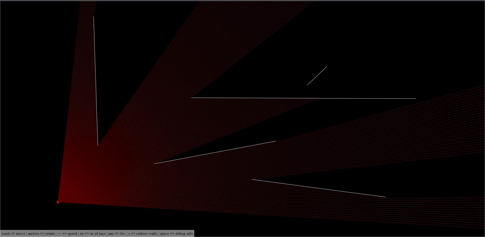

# Raycasting

Proof of concept of a raycaster implemented in Javascript.

## Live preview
https://vmmaia.github.io/Raycasting/

## Keyboard shortcuts
| Key | description |
| --- | ----------- |
| w | Move camera up |
| a | Move camera left |
| s | Move camera down |
| d | Move camera right |
| Arrow left | Rotate camera left |
| Arrow right | Rotate camera right |
| + | Increase camera movement speed |
| - | Decrease camera movement speed |
| t | Decrease the number of boundaries |
| y | Increase the number of boundaries |
| z | Decrease the number of rays |
| x | Increase the number of rays |
| n | Decrease the field of vision |
| m | Increase the field of vision |
| r | Redraw the map walls |
| Space | Show debug information |

Vasco Maia 
October 2022
